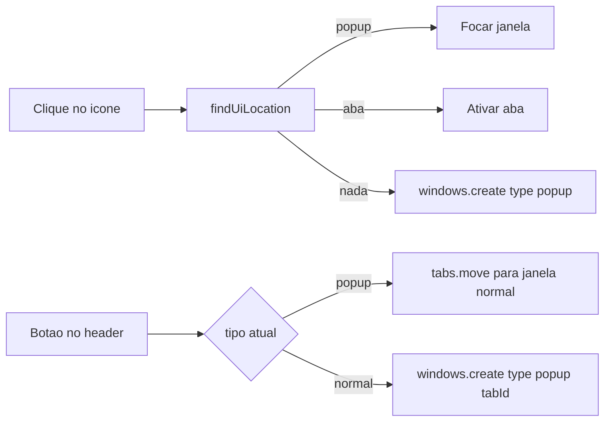

# Botão janela flutuante ↔ aba

Sim: o Chrome não deixa mudar `type` da janela no lugar (`windows.update` não aceita `type`), mas **move a aba existente** sem reload.

- Flutuante → aba: [`browser.tabs.move`](https://developer.chrome.com/docs/extensions/reference/api/tabs#method-move) para a última janela `normal` focada (`index: -1`).
- Aba → flutuante: [`browser.windows.create({ tabId, type: 'popup' })`](https://developer.chrome.com/docs/extensions/reference/api/windows#method-create) reusa a mesma aba.
- Permissões `tabs` e `windows` já estão em [`wxt.config.ts`](wxt.config.ts). Sem reload → busca, accordion e item selecionado continuam.



## Comportamento

- Botão no header ([`entrypoints/ui/index.html`](entrypoints/ui/index.html), `.top-actions`, à esquerda de **Gravar**), estilo `ghost`.
  - Em popup: **Abrir em aba** (`title` / `aria-label`).
  - Em aba: **Abrir em janela**.
- Destino da aba: última janela `normal` focada (já é o critério de [`resolveTargetTab`](entrypoints/ui/main.ts)). Se essa janela não existir ou for a própria, criar `type: 'normal'` com o `tabId`.
- Depois do move: ativar a aba e focar a janela de destino.
- Clique no ícone: focar a UI **onde ela estiver** (popup ou aba). Não criar segunda instância.
- `selectTargetTab` já ignora `chrome-extension://`; **Gravar** não aponta para a própria UI.

**Fora de escopo:** persistir modo (aba vs flutuante) entre sessões; memória extra de “última aba de site” ao gravar com a UI dockada; bump de versão.

## 1. Helpers puros em [`lib/floatingWindow.ts`](lib/floatingWindow.ts)

Generalizar `findFloatingWindowId` (hoje só `type === 'popup'`):

```ts
export type UiLocation =
  | { kind: 'popup'; windowId: number; tabId: number }
  | { kind: 'tab'; windowId: number; tabId: number };

export function findUiLocation(windows, panelUrl): UiLocation | null
```

- Mesmo `normalizePanelUrl` (ignora query/hash).
- Se existir popup **e** aba (estado inválido), preferir popup.
- `floatingAdoptOptions(tabId)` → `{ tabId, type: 'popup', width, height }`.
- `pickDockWindowId(currentWindowId, lastFocusedNormalId, otherNormalIds)` → id da janela alvo ou `null` (aí o background cria janela nova).

Testes em [`lib/floatingWindow.test.ts`](lib/floatingWindow.test.ts): popup, aba em `normal`, os dois ao mesmo tempo, URL com `?`/`#`, nenhum host, dock target.

## 2. Background em [`entrypoints/background.ts`](entrypoints/background.ts)

- `openFloatingWindow` → `openOrFocusUi`: `windows.getAll({ populate: true })` (não só popup), depois `findUiLocation`; focar popup **ou** `tabs.update` + `windows.update`.
- Nova mensagem `TOGGLE_UI_WINDOW` em [`lib/types.ts`](lib/types.ts). Handler usa `sender.tab`; se `windows.get(windowId).type === 'popup'` faz `tabs.move`, senão `windows.create(floatingAdoptOptions(tabId))`. Erro se não houver `sender.tab`.

## 3. UI

- Botão `#window-mode-btn` em [`entrypoints/ui/index.html`](entrypoints/ui/index.html) + CSS em [`entrypoints/ui/style.css`](entrypoints/ui/style.css).
- No boot: `windows.getCurrent()` para o rótulo; clique envia `TOGGLE_UI_WINDOW`; no sucesso, atualizar rótulo (o contexto JS sobrevive ao move).

## 4. Docs e verificação

- Fixtures em [`docs/screenshots/fixtures/`](docs/screenshots/fixtures/) (pelo menos painel vazio e lista): o botão no header.
- [`README.md`](README.md): ícone foca janela **ou** aba; o botão alterna os dois modos.
- `npm test` e `npm run compile`. Manual: ícone com UI em aba não abre segundo popup; toggle ida e volta sem perder seleção; **Gravar** ainda aponta para a aba do site.
