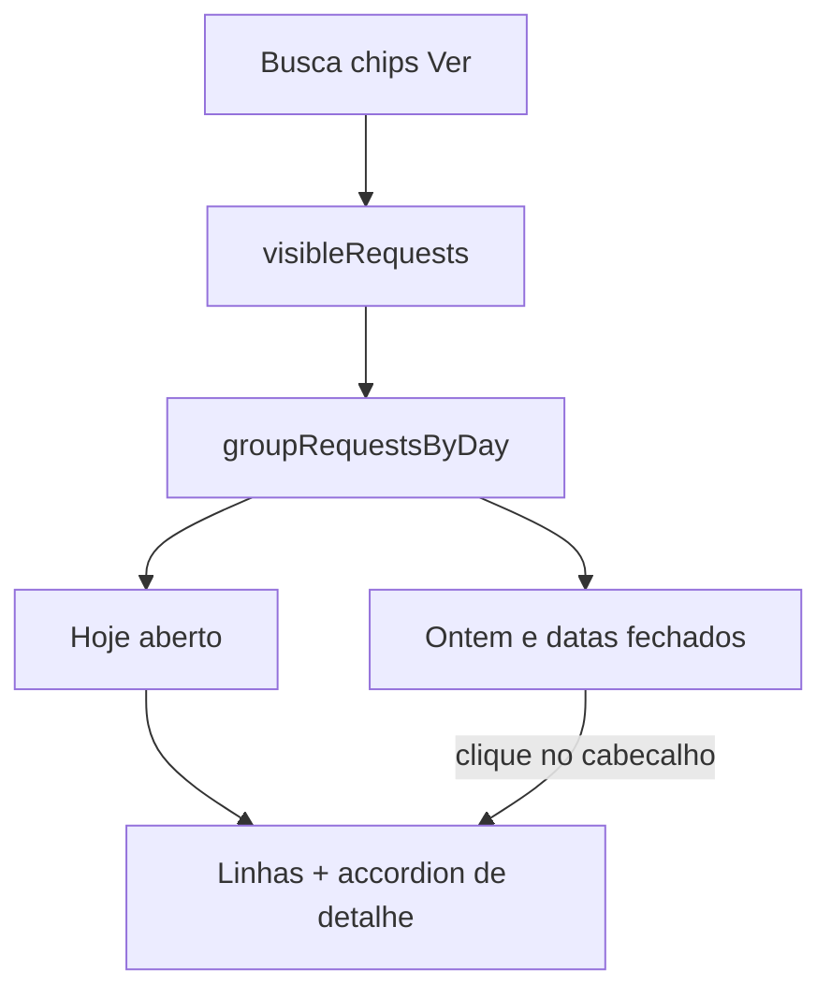

# Accordion da lista por dia de gravação

A lista em [`entrypoints/ui/main.ts`](entrypoints/ui/main.ts) hoje é plana (`visibleRequests()` → um `<li>` por clone). A data já existe em `capturedAt`; falta **agrupar por dia local** e só revelar os itens ao clicar no cabeçalho do dia.

**Decisões (suas):** accordion na lista (não select); **Hoje começa aberto**; outros dias fechados.

**Fora de escopo:** [`entrypoints/sidepanel/`](entrypoints/sidepanel/) (legado); persistir quais dias estão abertos; filtrar exportação pelos dias abertos (continua exportando o que passou em busca/chips/Ver).



## Abordagem

Cabeçalhos na própria lista (mesmo padrão do accordion de detalhe já existente), com estado em memória. Não usar `<select>` (você descartou) nem `<details>` nativo (o clique/toggle do detalhe já é controlado em JS; misturar os dois fica frágil).

## 1. Helpers de dia em [`lib/format.ts`](lib/format.ts)

Funções puras, relógio/`now` injetável nos testes (construtor local `new Date(2026, 8, 5, …)` para não depender de UTC):

- `dayKeyFromTimestamp(ts)` → `'YYYY-MM-DD'` no fuso **local** (o mesmo critério de `formatTime`).
- `labelForDayKey(dayKey, now = Date.now())` → `'Hoje'` | `'Ontem'` | `toLocaleDateString('pt-BR')` (ex. `04/09/2026`). “Ontem” é o **dia civil** anterior, não 24h.
- `formatClock(ts)` → só hora (`toLocaleTimeString('pt-BR', { hour, minute, second })`) para a linha; o detalhe continua com `formatTime` (data+hora).

Testes novos em [`lib/format.test.ts`](lib/format.test.ts): hoje, ontem, dia mais antigo, virada de meia-noite (`new Date(2026, 8, 5, 0, 30)` vs `new Date(2026, 8, 4, 23, 50)`).

## 2. Agrupar depois dos filtros

Novo [`lib/groupByDay.ts`](lib/groupByDay.ts) + [`lib/groupByDay.test.ts`](lib/groupByDay.test.ts):

```ts
export type DayGroup = {
  dayKey: string;
  label: string;
  items: ClonedRequest[];
};

export function groupRequestsByDay(
  items: ClonedRequest[],
  now?: number,
): DayGroup[]
```

- Entrada já ordenada por `capturedAt` desc ([`lib/storage.ts`](lib/storage.ts)).
- Dias mais novos primeiro; dentro do dia mantém a ordem.
- Lista vazia → `[]`.
- Chamado **depois** de `filterRequests` / `visibleRequests()`, então um dia sem itens visíveis não aparece.

## 3. Accordion na UI

Em [`entrypoints/ui/main.ts`](entrypoints/ui/main.ts) `renderList()`:

Estado: `Map<string, boolean>` (`dayKey` → aberto/fechado). Sem entrada no map:

- `dayKey === dayKeyFromTimestamp(Date.now())` → **aberto**
- qualquer outro dia → **fechado**

Clique no cabeçalho grava o contrário no map. Não mexe em `selectedId`. Se o item selecionado está num dia fechado, o detalhe some até o dia reabrir.

Marcação (dentro de `#request-list`):

- `li.day-group` com `button.day-header` (`aria-expanded`): texto `Hoje (3)` + chevron.
- Só se aberto: `ul.day-items` com os `<li>` atuais (`.request-row`, detalhe, HTTP/JSON com `stopPropagation`).
- Clique no header: `stopPropagation` para não abrir detalhe.
- Estado vazio: igual hoje (`empty-row`).

[`entrypoints/ui/style.css`](entrypoints/ui/style.css): header de dia com fundo um pouco distinto, sem hover de linha de request; `.day-items` herda o grid atual; `li.day-group` sem `cursor: pointer` no grupo inteiro.

## 4. Fixtures, README, verificação

- [`docs/screenshots/fixtures/lista-e-detalhe.html`](docs/screenshots/fixtures/lista-e-detalhe.html): um grupo **Hoje** aberto com as linhas; um **Ontem** fechado (só o cabeçalho). Horário na linha vira só hora.
- [`README.md`](README.md) item 5: lista agrupada por dia de gravação; Hoje aberto; clique na data revela os clones.
- `npm test` e `npm run compile`. Conferência na janela: dois dias no IndexedDB → Hoje aberto, Ontem fechado até o clique; accordion de detalhe inalterado; busca/Ver escondem dias sem match.
