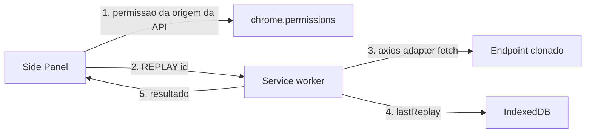

# Replay com axios na extensão

O botão **Repetir** deixa de reexecutar via `fetch` no interceptor da página. Passa a usar **axios no service worker**, com os dados já persistidos no clone (`url`, `method`, headers sanitizados e `requestBody`).

## Fluxo novo



1. Clique em **Repetir** pede host permission da **origem da URL clonada** (não da aba) — gesto do usuário, obrigatório no Chrome.
2. Mensagem `REPLAY` vai ao background **sem exigir `tabId`**.
3. Background monta o config axios a partir do clone e dispara a chamada.
4. Status, headers e body da resposta entram em `lastReplay` (como hoje) e o detalhe mostra “Última execução”.

## Por que no service worker

A origem da extensão é `chrome-extension://…`. Axios no painel ou no SW **não sofre CORS** se houver host permission da API. O SW já persiste o clone e trata `REPLAY`; axios 1.x no worker precisa do **adapter `fetch`** (não existe `XMLHttpRequest` no MV3 SW).

Cookies da API entram automaticamente com host permission + `withCredentials: true` (`credentials: 'include'`). CSRF em header (ex.: `X-CSRF-Token`, `Authorization`) segue no clone. O header `Cookie` capturado continua removido por [`sanitizeReplayHeaders`](lib/headers.ts) — o browser anexa os cookies reais.

**Limite consciente:** cookies `HttpOnly`/SameSite e tokens só no JS da página podem não bater 100% com o replay in-page atual. É o trade-off da opção “na extensão”.

## Mapeamento clone → axios

Estender [`lib/replay.ts`](lib/replay.ts):

- `buildReplayInit` passa a usar `credentials: 'include'` (hoje é `same-origin`, inútil a partir da extensão).
- Nova `toAxiosConfig(init)`:

```ts
{
  url: init.url,
  method: init.method,
  headers: init.headers,
  data: init.body ?? undefined, // string crua; GET/HEAD já vêm sem body
  adapter: 'fetch',
  responseType: 'text',
  withCredentials: true,
  validateStatus: () => true, // 4xx/5xx não lançam; o painel mostra o status
  timeout: 30_000,
  transformRequest: [(data) => data],
  transformResponse: [(data) => data],
}
```

- Nova `executeReplay(init)` chama `axios.request`, mede duração e devolve o mesmo formato de hoje (`status`, `statusText`, `responseHeaders`, `responseBody`, `durationMs`). Erro de rede vira mensagem clara.

Não parsear JSON do payload: reenviar a string original evita mudar o body.

## Arquivos

- **Add:** `axios` em [`package.json`](package.json).
- **Modify:** [`lib/replay.ts`](lib/replay.ts) + [`lib/replay.test.ts`](lib/replay.test.ts) (`toAxiosConfig`; `executeReplay` com `axios.request` mockado).
- **Modify:** [`entrypoints/background.ts`](entrypoints/background.ts) — `replayRequest` chama `executeReplay` no lugar de `replayInTab` / `injectIntoTab`.
- **Modify:** [`entrypoints/sidepanel/main.ts`](entrypoints/sidepanel/main.ts) — no clique, `permissions.request({ origins: [originPatternFromUrl(item.url)] })`; remover o erro “Abra a aba original…”.
- **Modify:** [`lib/types.ts`](lib/types.ts) — `REPLAY` sem `tabId` obrigatório.
- **Cleanup (um caminho só):** remover replay in-page de [`entrypoints/interceptor.ts`](entrypoints/interceptor.ts) (`runReplay` / listener `replay`), [`entrypoints/bridge.ts`](entrypoints/bridge.ts) (`replayViaPage`) e tipos/testes de mensagem de replay em [`lib/protocol.ts`](lib/protocol.ts) / [`lib/protocol.test.ts`](lib/protocol.test.ts). Captura `fetch`/`XHR` permanece.
- **Modify:** [`README.md`](README.md) — replay pela extensão via axios; pode pedir permissão da origem da API.

## Testes

- `toAxiosConfig`: URL, método em maiúsculas, headers sanitizados, `data` no POST, sem `data` no GET/HEAD, `adapter: 'fetch'`, `responseType: 'text'`.
- `executeReplay`: mock de `axios.request` devolve 201 + body; resultado mapeado. Mock de rejeição de rede vira erro.

Comando: `npm test` e `npm run compile`.

## Verificação manual

Página de teste (`npm run test:page`): gravar GET/POST no jsonplaceholder, **Repetir** com a aba fechada ou em outro site, conferir prompt de permissão da API, status no detalhe e que a gravação não duplica o clone (axios não passa pelo interceptor da página).
