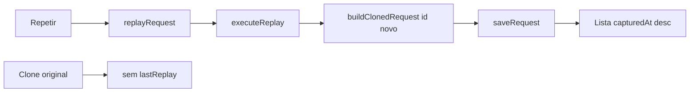

# Data/hora na lista e replay como novo clone

Hoje o clone já tem `capturedAt` (`Date.now()` em [`lib/clone.ts`](lib/clone.ts)), mas a UI só mostra hora via `formatTime`. **Repetir** só faz `updateRequest(id, { lastReplay })` no mesmo item — o axios no service worker não passa pelo interceptor, então nada novo entra na lista.

Decisão combinada: cada **Repetir** bem-sucedido vira **um clone novo**; o original fica intacto; o bloco **Última execução** some (o histórico é a lista). Seleção permanece no original para poder repetir de novo com o mesmo rascunho.



## 1. Data e hora de armazenamento

Em [`lib/format.ts`](lib/format.ts), `formatTime` passa a usar `toLocaleString('pt-BR')` com dia/mês/ano + hora/minuto/segundo (ex.: `05/09/2026, 12:25:30`).

Call sites já existentes em [`entrypoints/ui/main.ts`](entrypoints/ui/main.ts) (lista ~283 e meta do detalhe ~341) passam a mostrar data+hora sem mudança de API.

Testes novos em `lib/format.test.ts` com timestamp local fixo (`new Date(2026, 8, 5, 12, 25, 30)`), para não depender de fuso.

Na lista, a coluna de tempo (`auto` no grid) fica mais larga; se quebrar linha, `white-space: nowrap` em [`.request-list`](entrypoints/ui/style.css) no span `.muted`.

Atualizar horários só-hora nas fixtures [`docs/screenshots/fixtures/lista-e-detalhe.html`](docs/screenshots/fixtures/lista-e-detalhe.html) e [`docs/screenshots/fixtures/loja.html`](docs/screenshots/fixtures/loja.html).

## 2. Repetir adiciona um item à lista

Nova função testável em [`lib/clone.ts`](lib/clone.ts):

```ts
clonedRequestFromReplay(original, source, httpResult): ClonedRequest
```

Reusa `buildClonedRequest`: request vem do rascunho (`source`), resposta/duração do axios, `tabId`/`pageUrl` do original, `id` e `capturedAt` novos. Sem `lastReplay`.

Em [`entrypoints/background.ts`](entrypoints/background.ts) `replayRequest`:

- Continua `executeReplay(buildReplayInit(source))`.
- Sucesso: `saveRequest(clonedRequestFromReplay(...))` + `REQUESTS_UPDATED` (hoje o replay não emite isso).
- Não chama `updateRequest` / não grava `lastReplay`.
- Erro de rede: igual hoje — mensagem, **sem** item novo.
- Retorno: `{ request: novoClone }` para a UI.

Na UI ([`entrypoints/ui/main.ts`](entrypoints/ui/main.ts)):

- Remover o bloco `if (item.lastReplay)` (“Última execução”).
- `refresh()` após sucesso já relista; **não** mudar `selectedId` (o original continua selecionado; o novo aparece no topo).
- Ajustar o status para deixar claro que entrou na lista.

`lastReplay` permanece opcional em [`lib/types.ts`](lib/types.ts) só para clones antigos no IndexedDB; não migrar nem apagar.

Não alterar [`entrypoints/sidepanel/`](entrypoints/sidepanel/) — a UI ativa é `entrypoints/ui/`.

## 3. Docs e verificação

[`README.md`](README.md): **Repetir** grava um clone novo (data/hora agora, resposta dessa execução); o original não muda. O axios no SW continua fora do interceptor — um clique = um item, não dois.

Verificação: `npm test` e `npm run compile`. Conferência na janela flutuante: lista com data+hora; Repetir adiciona linha no topo com a nova resposta; original intacto; falha de rede não cria item.

## Fora de escopo

- Ligar clones (campo `parentId`).
- Auto-selecionar o clone novo.
- Remover `lastReplay` do tipo / migração IndexedDB.
- Relógio relativo (“há 2 min”).
