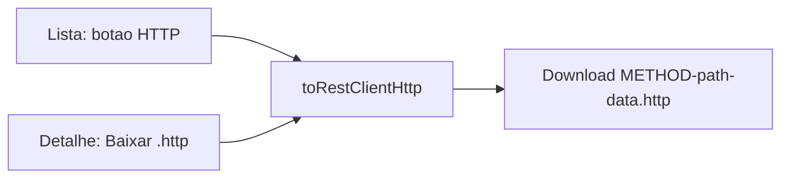

# Exportar request no formato REST Client

**Goal:** Cada clone ganha um botão próprio que baixa um `.http` pronto para colar/abrir no [REST Client](https://marketplace.visualstudio.com/items?itemName=humao.rest-client) (Huachao Mao), com request **e** parâmetros (query, headers, body).

**Arquitetura:** Um gerador puro em `lib/` (testável, no mesmo espírito de [`lib/curl.ts`](lib/curl.ts) e [`lib/exportJson.ts`](lib/exportJson.ts)). A UI só chama o gerador e dispara o download. Sem agrupamento por rota: “por endpoint” = **por `ClonedRequest`**, como o JSON já faz.

Não entra neste passo: export em lote `.http`, variáveis `{{token}}`, redação de segredos, HAR, nem usar o rascunho editável (igual cURL/JSON hoje: fonte = clone persistido).

## Formato gerado

Sintaxe oficial do REST Client:

- Comentário `###` com nome (`METHOD` + path) — também serve de separador se o arquivo for colado numa coleção.
- Linha da request: `METHOD` + origem + pathname (**sem** query string).
- Query em linhas seguintes (`?` no primeiro, `&` nos demais), indentadas com 2 espaços — é o “request + parâmetros” do plugin.
- Headers `Nome: valor`, um por linha.
- Linha em branco e depois o body, só se `requestBody` não for vazio.

Exemplo a partir de um `POST` com query `dry=1`:

```http
### POST /users
POST https://api.exemplo.com/users
  ?dry=1
content-type: application/json
authorization: Bearer secret

{"name":"Ana"}
```

GET sem body e sem query:

```http
### GET /users
GET https://api.exemplo.com/users
```

URL inválida: cair para `METHOD` + `url` inteira na primeira linha e, se houver `queryParams`, ainda emitir as linhas `?`/`&`.

## Arquivos

- **Criar** [`lib/restClient.ts`](lib/restClient.ts)
  - `toRestClientHttp(req: ClonedRequest): string`
  - `filenameForHttp(req: ClonedRequest): string` — mesmo padrão de [`filenameForRequest`](lib/exportJson.ts) (`METHOD-path-YYYY-MM-DD.http`), reusando a lógica de path sanitizado (extrair helper compartilhado de `sanitizePath`/`isoDate` **só se** ficar trivial; senão duplicar o mínimo no novo módulo para não inflar o refactor).
- **Criar** [`lib/restClient.test.ts`](lib/restClient.test.ts) — espelhar o `sample()` de [`lib/curl.test.ts`](lib/curl.test.ts):
  - POST com headers + body + query em linhas `?`/`&`
  - GET sem body (não deixa linha em branco extra antes do EOF)
  - vários query params (`?a=1` depois `&b=2`)
  - URL com search na `url` mas `queryParams` preenchido: request line **sem** `?…`
  - filename `.http`
- **Alterar** [`entrypoints/sidepanel/main.ts`](entrypoints/sidepanel/main.ts)
  - Lista (~264–272): botão compacto `HTTP` ao lado de `JSON`, `stopPropagation`, chama download do `.http`.
  - Detalhe (~318–323): ação **Baixar .http** ao lado de **Baixar JSON**.
  - Generalizar `downloadJson` para `downloadFile(filename, text, mime)` (`text/plain` no `.http`, `application/json` no JSON).
- **Alterar** [`entrypoints/sidepanel/style.css`](entrypoints/sidepanel/style.css)
  - Grid da lista: `52px 40px 1fr auto auto auto`.
  - Reusar `.json-btn` (ou classe compartilhada `.export-btn`) no novo botão.
- **Alterar** [`README.md`](README.md) — uma linha no fluxo do detalhe/lista (passo 5), junto de cURL/JSON.

## UI



Labels em português, curtas: lista `HTTP` (espelha `JSON`); detalhe `Baixar .http`. Status: `Arquivo .http baixado.`

O footer **Exportar todos** continua só JSON. Este botão é só por item.

## Fonte dos dados

Usar o `ClonedRequest` persistido (`queryParams`, `requestHeaders`, `requestBody`, `method`, `url`). Não o `ReplayDraft`. Comportamento alinhado a **Copiar cURL** / **Baixar JSON**.

## Testes e verificação

- `npx vitest run lib/restClient.test.ts` (e a suíte se o helper de filename for extraído).
- Não há testes de UI do sidepanel hoje; a verificação do botão é manual no painel (lista + detalhe + arquivo aberto no REST Client).
