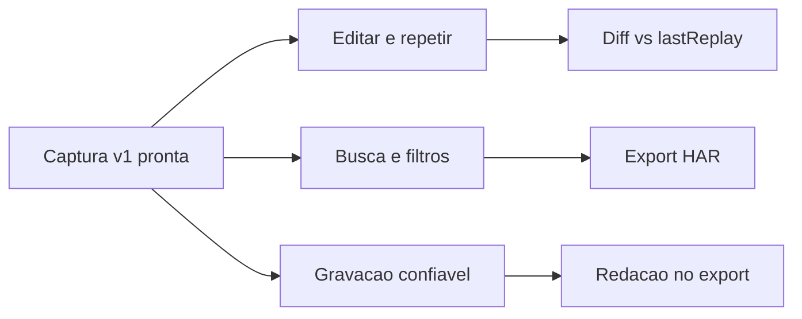

# Features que agregam valor

O produto já cobre o núcleo v1: gravar `fetch`/`XHR` com filtro, listar, detalhar, repetir via axios, copiar cURL e exportar JSON. O que falta para virar ferramenta de uso diário (e para outros devs adotarem) não é “capturar mais tipos de request” — é **fechar o ciclo de debug** e **não vazar segredo no export**.

Três caminhos possíveis:

- **A (recomendado) — fechar o loop clone → editar → repetir.** Máximo ROI: o clone vira um cliente HTTP mínimo, sem virar Postman.
- **B — interoperabilidade.** HAR/import, coleções, ambientes. Útil para outros devs, mas só depois de poder editar o clone.
- **C — capturar mais.** `chrome.debugger`, WebSocket, `sendBeacon`. Alto custo, aviso de debugger, pouco ganho no caso SPA típico. Deixar para depois (já está no plano original como modo avançado).

Seguir **A agora**, com um pedaço de higiene/privacidade (B leve) porque a extensão vai ser usada por outras pessoas.

## O que não vale a pena agora

- Página de Settings genérica, tema claro, i18n, Firefox.
- Ambientes estilo Postman, variáveis `{{token}}`, pastas/coleções.
- Captura via debugger / WebSocket.
- Replay de volta na página (o axios no service worker já é o caminho certo).

## Onda 1 — loop diário (fazer primeiro)

Estas três mudam o uso todo dia. Ordem sugerida:

### 1. Editar e repetir

Hoje [`REPLAY`](lib/types.ts) reenvia o clone congelado. O valor está em alterar URL, query, headers e body no detalhe e disparar de novo — como o “Edit and Resend” do DevTools, sem sair do painel.

- Campos editáveis no detalhe em [`entrypoints/sidepanel/`](entrypoints/sidepanel/).
- Persistência: ou um rascunho em `lastReplay` / `editedClone`, ou “salvar como novo clone” (não sobrescrever a captura original).
- Reusar [`lib/replay.ts`](lib/replay.ts) e [`lib/headers.ts`](lib/headers.ts); o axios já aceita config montado.
- Sem isso, “Repetir” só confirma que a API ainda responde o mesmo.

### 2. Filtros e busca que a lista já pede

[`lib/search.ts`](lib/search.ts) só olha método, status e URL. No dia a dia o dev procura `Authorization`, um `userId` no body, `POST` + `4xx`.

- Chips de método e faixa de status (2xx / 4xx / 5xx).
- Busca também em headers, query e body (com debounce; bodies grandes já truncam em 1 MB).
- **Exportar todos** deveria exportar o resultado filtrado, não o IndexedDB inteiro.

### 3. Confiabilidade da gravação (antes de convidar outros)

Gaps reais, não cosmética:

- Se `executeScript` falhar, o painel ainda mostra **Gravar** — avisar e não marcar a aba como gravando.
- Após o service worker morrer, [`restoreRecordingTabs()`](entrypoints/background.ts) restaura IDs mas **não reinjeta** até o próximo `onCommitted`.
- Badge no ícone (“REC”) e confirmação em **Limpar histórico**.

Sem isso, outro dev acha que está gravando e a lista fica vazia.

## Onda 2 — confiança e compartilhamento

Para uso próprio avançado e para publicar/compartilhar clones:

- **Redigir segredos no export/cURL.** `Authorization`, cookies e tokens na UI (mascarar) e no JSON/cURL (omitir ou `***`). Hoje o README promete que o header fica só local, mas o export JSON leva o clone inteiro.
- **Diff captura vs última execução.** Status, headers e body lado a lado a partir de `lastReplay` — o dado já existe em [`ClonedRequest`](lib/types.ts).
- **Export HAR** (um ou filtrados). Abre DevTools, Charles, Insomnia; JSON proprietário isola o usuário.
- **Limite/retenção do histórico** (ex.: 200 itens ou 7 dias). IndexedDB cresce sem teto.

## Onda 3 — só se a onda 1 estiver no sangue

- Duplicar um clone sem recapturar (atalho da edição).
- Importar o JSON próprio (e depois HAR).
- Pin / “salvar request” para não perder no clear.
- Modo debugger opcional, bem isolado e com aviso explícito.

## Recomendação imediata

Implementar **só a onda 1, item 1: editar e repetir**. É a feature que transforma o clone de arquivo morto em ferramenta. As outras duas da onda 1 (busca + confiabilidade) vêm em seguida, no mesmo espírito, sem expandir o produto para “Postman clone”.

Escopo mínimo do item 1:

- Detalhe com URL, query, headers e body editáveis (pré-preenchidos com o clone).
- **Repetir** usa o rascunho; a captura original permanece.
- **Restaurar original** descarta o rascunho.
- Reusar sanitização de headers e permissão da origem já existentes.
- Testes em `lib/` para montar o payload de replay a partir do rascunho; UI continua vanilla no side panel.

Nada de Settings, HAR, ambientes ou debugger neste passo.
