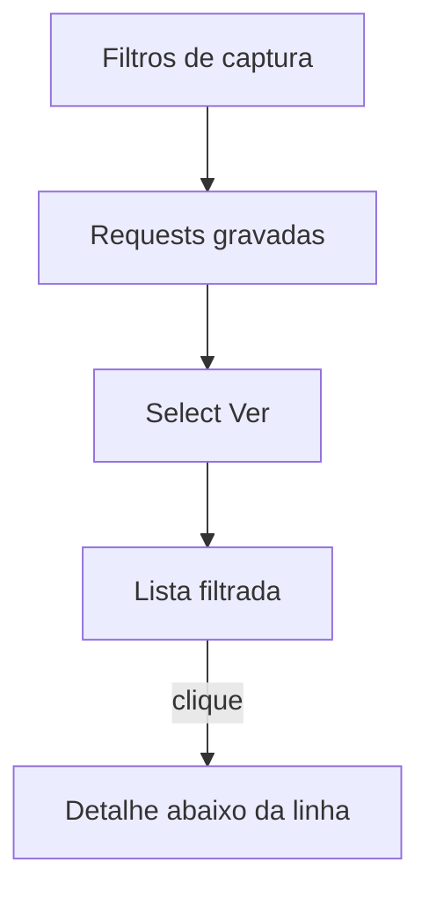

# Filtro de visualização e lista em accordion

Hoje os **Filtros** em [`entrypoints/ui/index.html`](entrypoints/ui/index.html) só controlam o que é **gravado**. A lista já tem busca e chips de método/status em [`lib/search.ts`](lib/search.ts), mas mistura todos os domínios. A URL na linha usa [`pathFromUrl`](lib/format.ts) (path + query, sem `...`) e o detalhe fica num painel separado (`#detail`) abaixo da lista.

**Decisões:** select **Ver: Todos | domínio A | domínio B** (filtros de captura); clique abre accordion na própria linha; URL curta com `...`.



Só alterar [`entrypoints/ui/`](entrypoints/ui/) (UI atual). Não duplicar em `entrypoints/sidepanel/` (legado do rename).

## 1. Filtro de visualização no `filterRequests`

Estender [`lib/search.ts`](lib/search.ts):

```ts
export type RequestListFilters = {
  methods?: string[];
  statusClasses?: StatusClass[];
  urlPattern?: string; // vazio = todos
};
```

Aplicar **antes** da busca textual, reusando [`matchUrl`](lib/matchUrl.ts): se `urlPattern` estiver definido, a request só passa se `matchUrl(item.url, urlPattern)`. Combina com chips e texto (AND). **Exportar filtrados** já usa `visibleRequests()`, então passa a respeitar o select.

Testes em [`lib/search.test.ts`](lib/search.test.ts) com dois hosts (`api.exemplo.com` e `api.outro.com`): `urlPattern` deixa só um; `Todos` (sem pattern) deixa os dois; combina com chip GET.

Helper de rótulo em [`lib/matchUrl.ts`](lib/matchUrl.ts): `labelForMatchPattern('https://api.foo.com/*')` → `api.foo.com`. Se dois padrões gerarem o mesmo rótulo, usar o padrão inteiro.

## 2. URL curta na lista

Em [`lib/format.ts`](lib/format.ts), adicionar `shortenDisplayUrl(url, maxLength = 40)`:

- Base: `pathFromUrl` (path + query)
- Se passar de 40 caracteres: primeiros 37 + `...`
- URL inválida: truncar a string crua do mesmo jeito

Testes novos em `lib/format.test.ts`. Na linha, `textContent = shortenDisplayUrl(item.url)` e `title = item.url` (tooltip com a URL completa). CSS `text-overflow: ellipsis` no span da URL como rede de segurança.

## 3. Select “Ver” na UI

Em [`entrypoints/ui/index.html`](entrypoints/ui/index.html), na seção `.search`, um select acima ou ao lado da busca:

- Opção `Todos` (`value=""`)
- Uma opção por item de `state.filters`, `value` = padrão, texto = `labelForMatchPattern`
- Visível só quando houver **2+** filtros de captura (com 0 ou 1 não há o que escolher). Se o padrão selecionado for removido, voltar para `Todos`.
- Estado em memória (`listFilters.urlPattern`), igual aos chips — sem persistir no storage.

[`entrypoints/ui/main.ts`](entrypoints/ui/main.ts): preencher o select em `render()`; `change` atualiza `listFilters` e chama `renderList()`.

## 4. Accordion no lugar do painel `#detail`

Remover `<article id="detail">` do HTML e o grid de duas linhas em [`.layout`](entrypoints/ui/style.css). A lista ocupa a área rolável inteira.

Cada `<li>` vira:

- **Linha resumo:** método, status, URL curta, horário, HTTP, JSON (como hoje)
- **Painel interno** só se `item.id === selectedId`: o conteúdo atual de `renderDetail()` (URL completa, ações, campos editáveis, resposta)

Clique na linha: se já está aberta, fecha (`selectedId = null`); senão abre só essa (uma de cada vez). Botões HTTP/JSON continuam com `stopPropagation`. `restoreDraft` re-renderiza só o item aberto.

CSS: `li` em bloco; `.request-row` no grid atual; `.request-detail` com padding e borda superior.

## 5. Fixtures, README e verificação

Atualizar fixtures em `docs/screenshots/fixtures/` (principalmente `lista-e-detalhe.html`): select “Ver”, URL com `...`, detalhe expandido dentro do `<li>` ativo. Menção breve no [`README.md`](README.md) na seção de uso.

Verificação: `npm test` e `npm run compile`. Conferência manual na janela: dois filtros de API → select filtra a lista; clique expande o detalhe abaixo; segundo clique fecha.
