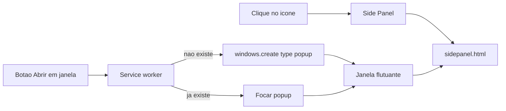

# Janela flutuante (painel + pop-out)

O Chrome **não deixa o Side Panel flutuar**. A solução é uma janela `type: 'popup'` (`browser.windows.create`), arrastável para outro monitor, reusando a UI atual em [`entrypoints/sidepanel/`](entrypoints/sidepanel/).

O clique no ícone **não muda**: continua [`openPanelOnActionClick: true`](entrypoints/background.ts) no service worker.



## Comportamento

- No header do painel (ao lado de **Gravar**): botão **Abrir em janela**.
- Se a janela já estiver aberta: só foca, não cria outra.
- Se a UI já estiver rodando na janela flutuante (`windows.getCurrent().type === 'popup'`): esconder o botão.
- O painel lateral permanece aberto; o usuário fecha com o X do Chrome. Sem API de close.
- Tamanho inicial ~440x760 (layout atual é estreito). Sem persistir posição nesta versão.

## Aba-alvo (obrigatório)

Hoje [`refresh()`](entrypoints/sidepanel/main.ts) faz:

```ts
browser.tabs.query({ active: true, lastFocusedWindow: true })
```

Com a janela flutuante em foco, `lastFocusedWindow` vira o próprio popup da extensão — **Gravar** apontaria para a página da extensão, não para o site.

Extrair em [`lib/targetTab.ts`](lib/targetTab.ts) (testável):

- Pedir a última janela `normal` (`windows.getLastFocused({ windowTypes: ['normal'] })`).
- Usar a aba ativa dessa janela.
- Ignorar abas `chrome-extension://`.

O service worker continua gravando por `tabId`; só muda de onde a UI lê “aba atual”.

## Arquivos

- **Criar** [`lib/floatingWindow.ts`](lib/floatingWindow.ts) + [`lib/floatingWindow.test.ts`](lib/floatingWindow.test.ts) — achar popup existente pela URL da extensão; opções de `create` (`type: 'popup'`, width/height).
- **Criar** [`lib/targetTab.ts`](lib/targetTab.ts) + [`lib/targetTab.test.ts`](lib/targetTab.test.ts) — escolher aba da última janela `normal`.
- **Alterar** [`lib/types.ts`](lib/types.ts) — mensagem `OPEN_FLOATING_WINDOW`.
- **Alterar** [`entrypoints/background.ts`](entrypoints/background.ts) — handler: `getAll` de popups com `sidepanel.html`; se achar, `windows.update({ focused: true })`; senão `windows.create`.
- **Alterar** [`wxt.config.ts`](wxt.config.ts) — permissão `"windows"` (query/focus/reuse).
- **Alterar** [`entrypoints/sidepanel/index.html`](entrypoints/sidepanel/index.html), [`main.ts`](entrypoints/sidepanel/main.ts), [`style.css`](entrypoints/sidepanel/style.css) — botão, hide no popup, `refresh()` via `getTargetTab`.
- **Alterar** [`README.md`](README.md) — ícone abre o painel; botão destaca janela.

URL da página: `browser.runtime.getURL('/sidepanel.html')` (WXT gera isso a partir de `entrypoints/sidepanel/index.html`).

## O que não entra

- Substituir o Side Panel pelo clique do ícone.
- Popup da toolbar (`default_popup`) — fecha ao clicar fora e é pequeno demais.
- Lembrar tamanho/posição da janela.
- Fechar o Side Panel automaticamente ao destacar.
