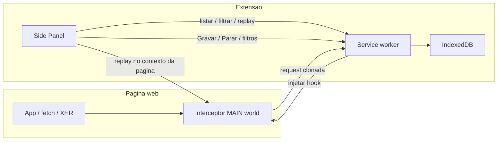

# Extensão Chrome clone-requests

## O que será construído

Extensão **Manifest V3** com **Side Panel**: o usuário configura filtros de URL da API, liga **Gravar**, navega no app, e a extensão guarda cada request correspondente. Depois dá para **buscar, inspecionar e repetir**.

Dados por request: método, URL, query params, headers de request, payload, status, headers de resposta, body da resposta, timestamp e duração.

## Abordagens consideradas

- **A (recomendada) — interceptar `fetch` e `XMLHttpRequest` na página:** injeta um script no mundo MAIN ao gravar. Captura body e resposta sem a faixa “Chrome is being controlled…”. Cobre o caso típico de API (SPA, axios, fetch). Não pega `sendBeacon`, WebSocket nem requests nativas do browser.
- **B — `chrome.debugger` (CDP Network):** captura quase tudo, inclusive o que o JS não vê. Mostra aviso de debugger e pede permissão sensível.
- **C — só `chrome.webRequest`:** headers e URL ok; **não entrega o body da resposta** no MV3. Não atende o requisito.

**Seguimos A.** Se no futuro faltar algum tipo de request, dá para adicionar debugger como modo avançado.

## Arquitetura




Fluxo de gravação:

1. Usuário abre o Side Panel, cadastra padrões de URL (ex.: `https://api.exemplo.com/*`).
2. Clica **Gravar** na aba ativa → service worker injeta o interceptor (`document_start` / imediato) e marca a aba como em gravação.
3. Cada `fetch`/XHR cuja URL casa com o filtro é serializado e enviado ao service worker.
4. Service worker persiste no IndexedDB (melhor que `chrome.storage` para bodies grandes).
5. Painel lista, busca e mostra o detalhe. **Repetir** reexecuta no contexto da página (cookies, CORS e CSRF iguais aos da app) e mostra o novo resultado sem apagar o clone original.

## Stack e estrutura

Projeto TypeScript com [WXT](https://wxt.dev/) (MV3, Side Panel, HMR). UI do painel em HTML/CSS/TS (sem React, para manter o bundle pequeno).

Arquivos principais:

- `[wxt.config.ts](wxt.config.ts)` + `[package.json](package.json)` — nome `clone-requests`, permissões `sidePanel`, `storage`, `scripting`, `activeTab`; host permissions pedidas na hora de gravar (origem da aba).
- `[entrypoints/background.ts](entrypoints/background.ts)` — estado Gravar/Parar por `tabId`, persistência, mensagens.
- `[entrypoints/interceptor.ts](entrypoints/interceptor.ts)` — wrap de `window.fetch` e `XMLHttpRequest` (MAIN world).
- `[entrypoints/sidepanel/](entrypoints/sidepanel/)` — UI: filtros, gravar, lista, detalhe, replay.
- `[lib/types.ts](lib/types.ts)`, `[lib/storage.ts](lib/storage.ts)`, `[lib/matchUrl.ts](lib/matchUrl.ts)` — modelo, IndexedDB, match de padrões.

## Modelo de dados

```ts
type ClonedRequest = {
  id: string
  tabId: number
  pageUrl: string
  capturedAt: number
  durationMs: number
  method: string
  url: string
  queryParams: Record<string, string>
  requestHeaders: Record<string, string>
  requestBody: string | null
  status: number
  statusText: string
  responseHeaders: Record<string, string>
  responseBody: string | null
  responseTruncated: boolean
}
```

Limite de body: **1 MB**; acima disso grava um aviso e `responseTruncated: true`. Headers como `Authorization` ficam só **localmente** (não sincronizar com `chrome.storage.sync`).

Filtros: lista de padrões estilo Chrome (`https://api.exemplo.com/*`, `*://*.meusite.com/v1/*`). Só clona se **algum** padrão casar.

## UI do Side Panel (português)

- Topo: **Gravar / Parar**, indicador da aba, atalho para **Filtros**.
- Filtros: adicionar/remover padrões; sem filtro ativo, **não grava nada** (evita lixo).
- Lista: método, status, path, horário; busca por URL/método/status.
- Detalhe: URL, query, headers, payload e resposta (JSON formatado se possível).
- Ações: **Repetir**, **Copiar cURL**, **Excluir**, **Limpar histórico**.

Replay: mesmo método/URL/headers/body; resultado aparece no detalhe como “última execução” (status + body novos).

## Limites conscientes (v1)

- Só `fetch` e `XHR` (não WebSocket / navegação de formulário / `sendBeacon`).
- Gravação **por aba**; recarregar a página mantém a gravação se o interceptor for reinyetado via `scripting` + `webNavigation` (incluir permissão `webNavigation` para re-injetar em reload).
- Extensão unpacked (Load unpacked); README com passos de instalação local.

## Verificação

- Página de teste simples (HTML + fetch para httpbin ou similar) para gravar, listar, filtrar e repetir.
- Conferir que requests fora do filtro não entram.
- Conferir Gravar/Parar e persistência após fechar o painel.

