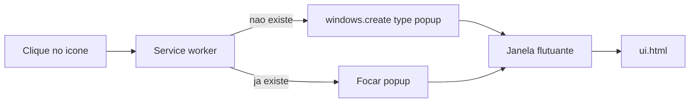

# Somente janela flutuante

Hoje o ícone abre o **Side Panel** (`openPanelOnActionClick: true` em [`entrypoints/background.ts`](entrypoints/background.ts)) e a janela flutuante só existe via o botão **Abrir em janela**. O Chrome não deixa o Side Panel flutuar; a janela já é um `browser.windows.create({ type: 'popup' })` reusando a mesma UI.

**Comportamento novo:** clique no ícone abre ou foca a janela flutuante. Sem painel lateral, sem `default_popup` da toolbar (fecha ao clicar fora e é pequeno demais).

## Decisão de entrypoint

A pasta [`entrypoints/sidepanel/`](entrypoints/sidepanel/) faz o WXT registrar `side_panel` no manifest. Enquanto esse nome existir, o Chrome ainda oferece o painel na UI nativa.

**Renomear** `entrypoints/sidepanel/` para `entrypoints/ui/` (HTML unlisted). A URL vira `browser.runtime.getURL('/ui.html')`. A UI (HTML/CSS/JS) permanece a mesma; só deixa de ser Side Panel.

Não usar `entrypoints/popup/` — isso vira `default_popup` e quebra o fluxo desejado.

## Background e permissões

Em [`entrypoints/background.ts`](entrypoints/background.ts):

- Remover `browser.sidePanel.setPanelBehavior({ openPanelOnActionClick: true })`.
- Registrar `browser.action.onClicked` chamando a `openFloatingWindow()` já existente (reusa se achar popup com a URL da UI; senão cria 440x760).
- Trocar `/sidepanel.html` por `/ui.html`.
- Remover o case `OPEN_FLOATING_WINDOW` (não há mais botão na UI).

Em [`wxt.config.ts`](wxt.config.ts): tirar a permissão `sidePanel`. Manter `windows`.

Em [`lib/types.ts`](lib/types.ts): remover `{ type: 'OPEN_FLOATING_WINDOW' }`.

## UI

Em [`entrypoints/ui/index.html`](entrypoints/sidepanel/index.html) (após o rename) e [`main.ts`](entrypoints/sidepanel/main.ts):

- Remover o botão `#popout-btn` e o CSS associado, se houver.
- Remover `hidePopoutIfFloating`, `openFloatingWindow` e o listener do botão.
- Manter `getTargetTab` / `resolveTargetTab` — a janela flutuante em foco continua não sendo a aba do site.

## Testes e docs

- [`lib/floatingWindow.test.ts`](lib/floatingWindow.test.ts) e [`lib/targetTab.test.ts`](lib/targetTab.test.ts): atualizar URLs de `sidepanel.html` para `ui.html`.
- Fixtures em `docs/screenshots/fixtures/*.html`: o `href` do CSS aponta para `entrypoints/sidepanel/style.css` — atualizar para `entrypoints/ui/style.css`.
- [`README.md`](README.md): ícone abre a janela flutuante; remover menção ao painel lateral e ao botão.

Verificação: `npm test` e `npm run compile`. Conferência manual: clicar no ícone abre/foca o popup; não aparece Side Panel; Gravar ainda aponta para a aba normal.

## Fora de escopo

- Persistência de tamanho/posição da janela.
- `default_popup` da toolbar.
- Bump de versão.
