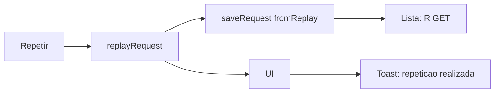

# Toast de replay e prefixo R na lista

Hoje o **Repetir** já grava um clone novo ([`clonedRequestFromReplay`](lib/clone.ts)) e a UI chama `showStatus('Requisição repetida e adicionada à lista.')` — um banner fixo no topo (`#status`), fácil de ignorar. O clone novo é indistinguível do original: não há campo que marque origem, e o método na lista é só `GET`/`POST`.



## Decisões

- **Toast overlay**, não o banner `#status`. Flutuante na janela, some sozinho (~3s). Sucesso de replay deixa de usar `showStatus` para não duplicar aviso. Erros de replay (rede, permissão, URL inválida) continuam no banner de erro.
- **Flag persistida** `fromReplay?: boolean` em [`ClonedRequest`](lib/types.ts). Não prefixar o campo `method` (quebraria chips, CSS `.method.GET` e export). Clones antigos no IndexedDB sem o campo não mostram `R`.
- Texto do toast: **Repetição do request realizada.**
- Prefixo só na lista: `R GET`, `R POST` (método continua em maiúsculas). Detalhe, cURL e arquivos exportados não mudam o método.

## 1. Marcar clone de replay

Em [`lib/types.ts`](lib/types.ts), adicionar `fromReplay?: boolean` em `ClonedRequest`.

Em [`lib/clone.ts`](lib/clone.ts), `clonedRequestFromReplay` passa a retornar `{ ...buildClonedRequest(...), fromReplay: true }`. Captura normal (`buildClonedRequest`) não define o campo. Repetir um item que já é replay também gera outro com `fromReplay: true`.

Testes em [`lib/clone.test.ts`](lib/clone.test.ts): o clone de replay tem `fromReplay: true`; o de captura não tem a propriedade.

## 2. Label `R METHOD`

Em [`lib/format.ts`](lib/format.ts):

```ts
export function formatMethodLabel(method: string, fromReplay?: boolean): string {
  const upper = method.toUpperCase();
  return fromReplay ? `R ${upper}` : upper;
}
```

Testes em [`lib/format.test.ts`](lib/format.test.ts): `GET` → `GET`; replay `POST` → `R POST`; `get` → `GET`.

Na lista em [`entrypoints/ui/main.ts`](entrypoints/ui/main.ts) (~319–321): `method.textContent = formatMethodLabel(item.method, item.fromReplay)` e `className` continua `method ${item.method}` para a cor.

Em [`entrypoints/ui/style.css`](entrypoints/ui/style.css), `.method { white-space: nowrap; }` e a primeira coluna do grid de [`.request-row`](entrypoints/ui/style.css) de `52px` para `auto` (cabe `R DELETE`).

## 3. Toast na janela flutuante

Em [`entrypoints/ui/index.html`](entrypoints/ui/index.html), um `#toast` no `body` (`role="status"`).

CSS em [`entrypoints/ui/style.css`](entrypoints/ui/style.css): `position: fixed`, perto da base da janela, z-index alto, fundo contrastante (sucesso, alinhado à paleta atual).

Em [`entrypoints/ui/main.ts`](entrypoints/ui/main.ts): `showToast(message)` mostra o texto, cancela timer anterior e esconde após 3s. No `replay()` após sucesso:

```ts
showToast('Repetição do request realizada.');
await refresh();
```

Remover o `showStatus` de sucesso desse caminho.

## 4. Fixtures, README e verificação

- [`docs/screenshots/fixtures/lista-e-detalhe.html`](docs/screenshots/fixtures/lista-e-detalhe.html) (e [`loja.html`](docs/screenshots/fixtures/loja.html) se houver linha de replay): uma linha com `<span class="method POST">R POST</span>`.
- [`README.md`](README.md): após **Repetir**, toast de confirmação; itens de replay aparecem na lista como `R GET` / `R POST`.
- Não alterar [`entrypoints/sidepanel/`](entrypoints/sidepanel/) (UI ativa é `entrypoints/ui/`).

Verificação: `npm test` e `npm run compile`. Na janela: **Repetir** com sucesso → toast ~3s e nova linha no topo com `R …`; original sem `R`; falha de rede → banner de erro, sem item novo e sem toast de sucesso.

## Fora de escopo

- `parentId` / ligar clones.
- Prefixo `R` no título do detalhe, cURL ou nomes de arquivo.
- Toast para outras ações (cURL, download, gravar).
- Biblioteca de toast.
