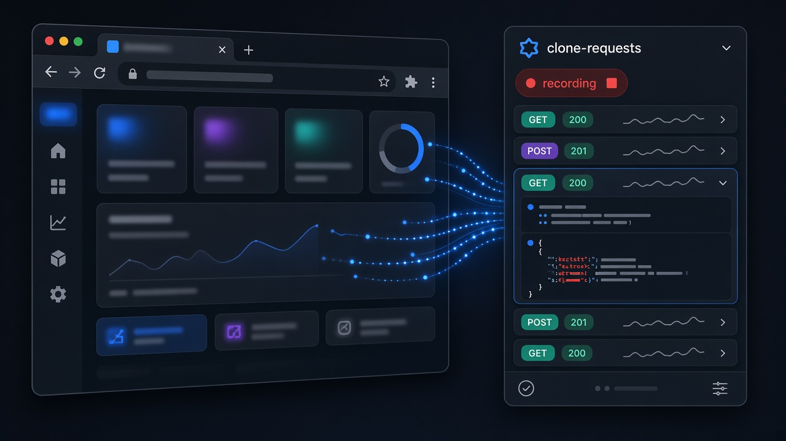
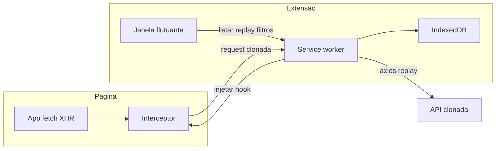

# clone-requests

Extensão Chrome (Manifest V3) para **clonar requisições de API**: guarda URL, headers, query params, payload e resposta, e permite consultar, editar, repetir, copiar cURL, exportar JSON e baixar `.http` (REST Client).



## Recursos

- Grava `fetch` e `XMLHttpRequest` com padrões de URL (match pattern do Chrome).
- Janela flutuante: o ícone da extensão abre ou foca a UI; **Abrir em aba** / **Abrir em janela** alterna o modo sem recarregar.
- Lista agrupada por dia (**Hoje** começa aberto); filtro **Ver** por domínio; chips de método e status; busca em URL, headers, query e body.
- Detalhe editável (método, URL, query, headers, payload) com **Restaurar original**.
- **Repetir** via axios no service worker: grava um clone novo com prefixo `R` (ex.: `R POST`) e mostra um toast de confirmação.
- Copiar cURL, baixar `.http` ([REST Client](https://marketplace.visualstudio.com/items?itemName=humao.rest-client)) e JSON; **Exportar filtrados** / **Exportar todos**.

## Como funciona

Ao clicar em **Gravar**, a extensão injeta um interceptor na página (mundo MAIN). Esse hook envolve `fetch` e `XMLHttpRequest`. Cada chamada cuja URL casa com um filtro cadastrado é serializada e enviada ao service worker, que persiste o clone no IndexedDB (com data/hora de armazenamento). A janela flutuante lista, busca e inspeciona o histórico. No detalhe você edita um rascunho: isso **não** altera o clone original. **Repetir** dispara a request pela extensão (axios no service worker) e **grava um clone novo** na lista com a resposta dessa execução — o original permanece intacto. Itens gerados por **Repetir** aparecem como `R GET`, `R POST`, etc. Ao concluir com sucesso, a janela mostra um toast (**Repetição do request realizada.**). O axios não passa pelo interceptor da página, então um clique gera um item, não dois.



- Sem filtro cadastrado, **nada é gravado**.
- A gravação é **por aba** e sobrevive a reload enquanto estiver ativa.
- Replay roda **na extensão** (axios no service worker) e pode pedir permissão da origem da API.
- Headers sensíveis (ex.: `Authorization`) ficam só no armazenamento local do Chrome.

## Requisitos

- Node.js 22+
- Google Chrome

## Instalar unpacked no Chrome

1. Rode `npm run build` (ou `npm run dev`).
2. Abra `chrome://extensions`.
3. Ative **Modo do desenvolvedor**.
4. Clique em **Carregar sem compactação**.
5. Selecione a pasta `deploy/chrome-mv3`.

O ícone da extensão abre ou foca a **janela flutuante** (ou a aba, se você já tiver usado **Abrir em aba**). Se a UI já existir, o clique só a foca — não abre uma segunda instância. Na janela, o botão **Abrir em aba** move o painel para uma aba na janela Chrome em uso; **Abrir em janela** faz o caminho inverso.

## Como usar

1. Abra o site da aplicação (ou a [página de teste](#página-de-teste)).
2. Na janela, o bloco de **Filtros** já abre se não houver nenhum cadastrado. Adicione um padrão de URL, por exemplo `https://api.exemplo.com/*`.


3. Clique em **Gravar** e aceite a permissão da origem da aba. O botão vira **Parar** e a extensão passa a clonar só o que casa com o filtro.


4. Dispare as chamadas de API. Só entram requests `fetch`/`XHR` que casam com o filtro.
5. Consulte a lista agrupada por dia de gravação (**Hoje** começa aberto; clique em **Ontem** ou numa data para revelar os clones daquele dia). Cada linha mostra a hora; o detalhe traz data e hora completas. Com **2+ filtros** de captura, use **Ver** para restringir por domínio. Use os chips de método/status e a busca (URL, headers, body) para afinar a lista. Clique numa linha para expandir o detalhe em accordion: edite método, URL, query, headers e payload; **Restaurar original** desfaz o rascunho. Use **Repetir**, **Copiar cURL**, **Baixar .http**, **Baixar JSON** ou **Excluir**. Em **Repetir**, aceite a permissão da origem da API se o Chrome pedir — a execução vira um **novo item** no topo da lista marcado com `R` no método (ex.: `R POST`), o original não muda, e um toast confirma a repetição. Na lista, os botões **HTTP** e **JSON** baixam só aquela requisição (`.http` no formato do [REST Client](https://marketplace.visualstudio.com/items?itemName=humao.rest-client); JSON completo); **Exportar filtrados** / **Exportar todos** no rodapé gera um único `.json` com o resultado atual da lista.


Painel vazio, antes de gravar:


## Página de teste

```bash
npm run test:page
```

Abra `http://localhost:4173`, cadastre o filtro `https://jsonplaceholder.typicode.com/*`, clique em **Gravar** e use os botões GET/POST.

A chamada para a PokeAPI **não** deve aparecer na lista.


## Filtros de URL

Os padrões seguem o estilo de match pattern do Chrome. A request só é clonada se **algum** filtro casar.

| Padrão | Casa com |
| --- | --- |
| `https://api.exemplo.com/*` | Qualquer path nessa origem HTTPS |
| `https://jsonplaceholder.typicode.com/*` | GET/POST da página de teste |
| `*://*.meusite.com/v1/*` | HTTP ou HTTPS em subdomínios, path `/v1/…` |

Sem filtro ativo, nada é gravado — inclusive na página de teste. O GET da PokeAPI (`https://pokeapi.co/…`) fica de fora quando o filtro é só `jsonplaceholder`.

## Limites (v1)

- Captura apenas `fetch` e `XMLHttpRequest` (não WebSocket, `sendBeacon` nem navegação de formulário).
- Bodies acima de 1 MB são truncados.
- Headers sensíveis (ex.: `Authorization`) ficam só no armazenamento local do Chrome.
- O replay pela extensão pode diferir da request original em cookies `HttpOnly`/SameSite ou tokens que só existem no JS da página.

## Desenvolvimento

```bash
nvm use
npm install
npm test
npm run dev
```

O `npm run dev` gera a extensão em `deploy/chrome-mv3` com recarga automática.

Para regenerar os prints deste README (a capa `hero.png` é ilustração e não sai deste script):

```bash
npm install --no-save playwright
npx playwright install chromium
node scripts/capture-screenshots.mjs
```
