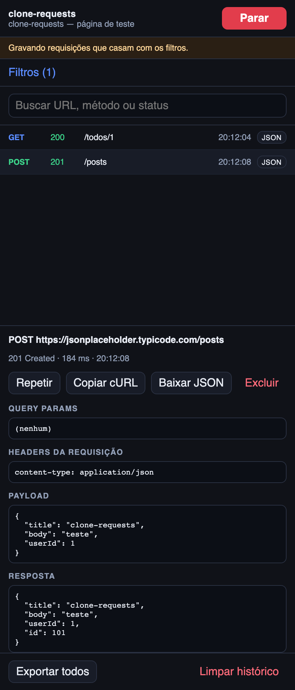
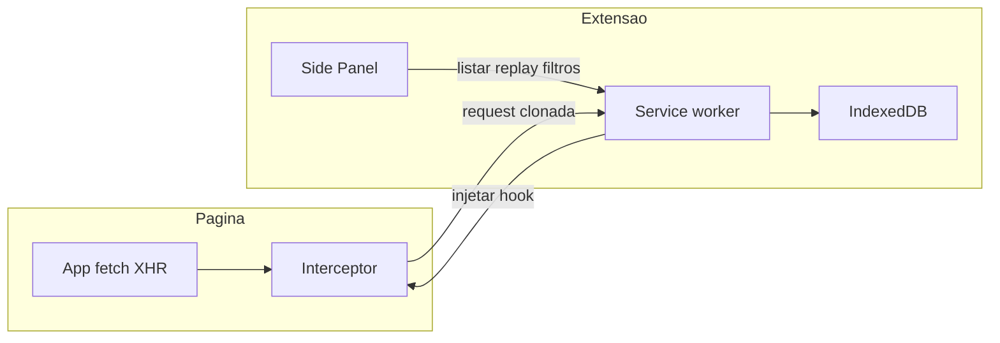
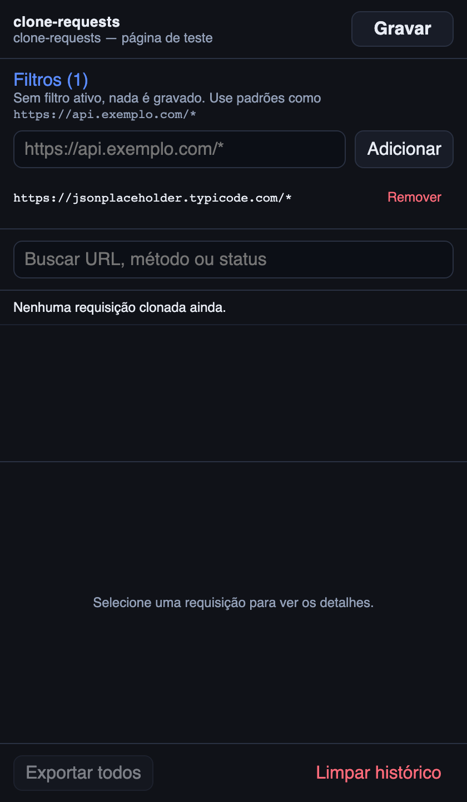
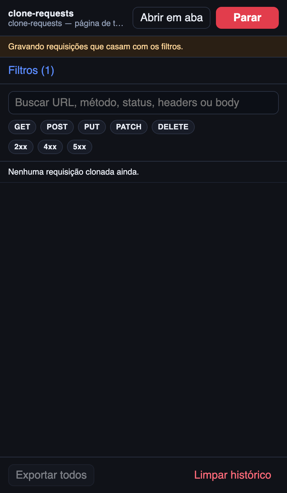
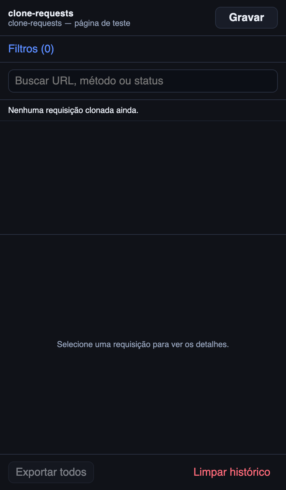
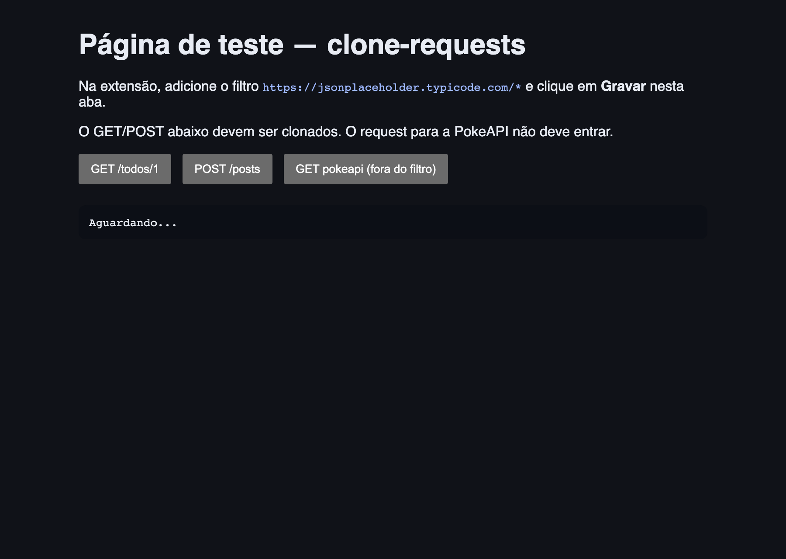

# clone-requests

Extensão Chrome (Manifest V3) para **clonar requisições de API**: guarda URL, headers, query params, payload e resposta, e permite consultar, repetir, copiar cURL e exportar JSON.



## Como funciona

Ao clicar em **Gravar**, a extensão injeta um interceptor na página (mundo MAIN). Esse hook envolve `fetch` e `XMLHttpRequest`. Cada chamada cuja URL casa com um filtro cadastrado é serializada e enviada ao service worker, que persiste o clone no IndexedDB. O painel lateral lista, busca e inspeciona o histórico. **Repetir** reexecuta a request no contexto da página — cookies, CORS e CSRF iguais aos da aplicação.



- Sem filtro cadastrado, **nada é gravado**.
- A gravação é **por aba** e sobrevive a reload enquanto estiver ativa.
- Replay roda **no contexto da página** (não a partir do service worker).
- Headers sensíveis (ex.: `Authorization`) ficam só no armazenamento local do Chrome.

## Requisitos

- Node.js 22+
- Google Chrome

## Instalar unpacked no Chrome

1. Rode `npm run build` (ou `npm run dev`).
2. Abra `chrome://extensions`.
3. Ative **Modo do desenvolvedor**.
4. Clique em **Carregar sem compactação**.
5. Selecione a pasta `.output/chrome-mv3`.

O ícone da extensão abre o **painel lateral**.

## Como usar

1. Abra o site da aplicação (ou a [página de teste](#página-de-teste)).
2. No painel, o bloco de **Filtros** já abre se não houver nenhum cadastrado. Adicione um padrão de URL, por exemplo `https://api.exemplo.com/*`.



3. Clique em **Gravar** e aceite a permissão da origem da aba. O botão vira **Parar** e a extensão passa a clonar só o que casa com o filtro.



4. Dispare as chamadas de API. Só entram requests `fetch`/`XHR` que casam com o filtro.
5. Consulte a lista, abra o detalhe e use **Repetir**, **Copiar cURL**, **Baixar JSON** ou **Excluir**. Na lista, o botão **JSON** baixa só aquela requisição; **Exportar todos** no rodapé gera um único `.json` com o histórico.


Painel vazio, antes de gravar:



## Página de teste

```bash
npm run test:page
```

Abra `http://localhost:4173`, cadastre o filtro `https://jsonplaceholder.typicode.com/*`, clique em **Gravar** e use os botões GET/POST.

A chamada para a PokeAPI **não** deve aparecer na lista.



## Filtros de URL

Os padrões seguem o estilo de match pattern do Chrome. A request só é clonada se **algum** filtro casar.

| Padrão | Casa com |
| --- | --- |
| `https://api.exemplo.com/*` | Qualquer path nessa origem HTTPS |
| `https://jsonplaceholder.typicode.com/*` | GET/POST da página de teste |
| `*://*.meusite.com/v1/*` | HTTP ou HTTPS em subdomínios, path `/v1/…` |

Sem filtro ativo, nada é gravado — inclusive na página de teste. O GET da PokeAPI (`https://pokeapi.co/…`) fica de fora quando o filtro é só `jsonplaceholder`.

## Limites (v1)

- Captura apenas `fetch` e `XMLHttpRequest` (não WebSocket, `sendBeacon` nem navegação de formulário).
- Bodies acima de 1 MB são truncados.
- Headers sensíveis (ex.: `Authorization`) ficam só no armazenamento local do Chrome.

## Desenvolvimento

```bash
nvm use
npm install
npm test
npm run dev
```

O `npm run dev` gera a extensão em `.output/chrome-mv3` com recarga automática.

Para regenerar os prints deste README:

```bash
npm install --no-save playwright
npx playwright install chromium
node scripts/capture-screenshots.mjs
```
